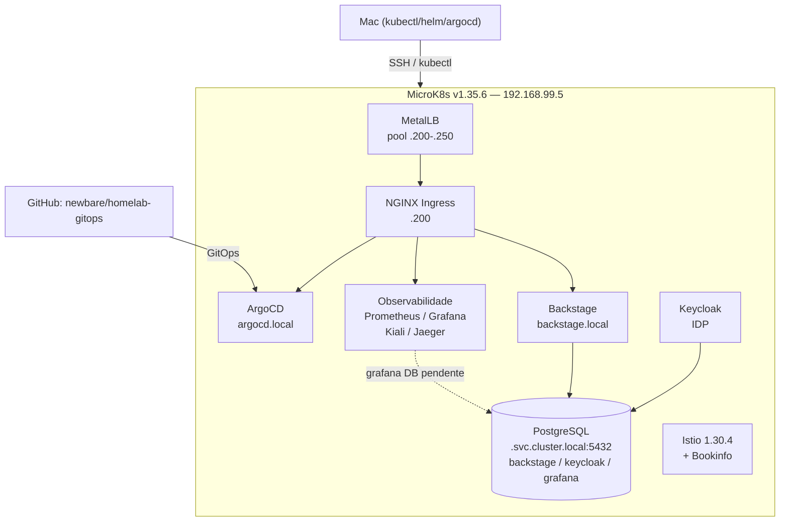

# Visão Geral — Homelab MK8s (Resilience Cloud)

> Documento-mãe do projeto: objetivo, arquitetura, checklist de fases e cronograma.
> Para detalhes de cada componente, ver os READMEs em `infrastructure/`.

**Última atualização:** 2026-09-18

---

## 🎯 Objetivo

Laboratório de estudos **GitOps → DevOps → DevSecOps → Infra**, rodando em
hardware físico, com **tudo declarativo e reconciliado pelo ArgoCD**.

O objetivo não é "subir um cluster", é **entender cada peça por dentro**:
por isso os componentes são instalados via Helm (não via add-ons prontos do
MicroK8s) e gerenciados como código no Git.

---

## 📌 Princípios do projeto

1. **Toda mudança é feita no Git** — `kubectl apply` direto é exceção.
2. **ArgoCD sincroniza automaticamente** — auto-sync + self-heal + prune.
3. **Imagens são imutáveis** — `v1`, `v2`, ... nunca `latest`.
4. **Decisões são documentadas** — ADRs e README por componente.
5. **Exceções são registradas** — runbook/troubleshooting.
6. **PostgreSQL único** — ver [regra de ouro](#-regra-de-ouro-postgresql-único).

---

## 🖥️ Ambiente

| Item | Valor |
|---|---|
| Servidor | Ubuntu Server, hostname `resilience-System-Product` |
| CPU | AMD A10-7860K (AMD-V) |
| RAM / Disco | 16 GB DDR3 / SSD 120 GB + HD 500 GB |
| IP do servidor | `192.168.99.5` (interface `enp3s0`) |
| Máquina de trabalho | MacBook Intel (2020) — `kubectl`, `helm`, `argocd` |
| Cluster | MicroK8s single-node, **K8s v1.35.6** (canal `1.35/stable`) |
| Faixa LoadBalancer | `192.168.99.200-250` (MetalLB) |

### Hosts publicados (`/etc/hosts` do Mac → `192.168.99.200`)

| Serviço | URL | Backend |
|---|---|---|
| ArgoCD | https://argocd.local | NGINX Ingress → argocd-server |
| Backstage | https://backstage.local | NGINX Ingress → backstage:7007 |
| Grafana | http://grafana.local | NGINX Ingress → kube-prometheus-stack-grafana |
| Kiali | http://kiali.local/kiali/ | NGINX Ingress → kiali:20001 |
| Jaeger | http://jaeger.local | NGINX Ingress → jaeger-query:16686 |
| Bookinfo | http://bookinfo.local/productpage | Istio Gateway (`.201`) |

---

## 🧱 Stack técnica (versões fixadas)

| Componente | Versão | Como | Namespace |
|---|---|---|---|
| MicroK8s | 1.35.6 | snap | — |
| Helm | v3.19.0 | binário (⚠️ **não** Helm 4) | — |
| kubectl | v1.35.x | `kubernetes-cli@1.35` | — |
| MetalLB | chart 0.16.1 | ArgoCD + Helm | `metallb-system` |
| NGINX Ingress | chart 4.15.1 | ArgoCD + Helm | `ingress-nginx` |
| ArgoCD | chart 10.9.0 (app v3.5.2) | Helm | `argocd` |
| Istio | 1.30.4 (base/istiod/gateway) | ArgoCD + Helm | `istio-system` |
| kube-prometheus-stack | chart 91.2.1 | ArgoCD + Helm | `monitoring` |
| Kiali Operator | chart 2.31.0 | ArgoCD + Helm | `kiali-operator` |
| Jaeger Operator | chart 2.57.0 | ArgoCD + Helm | `observability` |
| metrics-server | chart 3.14.0 | ArgoCD + Helm | `kube-system` |
| cert-manager | chart v1.21.2 | ArgoCD + Helm | `cert-manager` |
| PostgreSQL | `17-alpine` | ArgoCD (manifestos) | `postgresql` |
| Keycloak | chart 24.4.0 (img 26.0.7) | ArgoCD + Helm | `keycloak` |
| Backstage | 1.54.0 (imagem própria) | ArgoCD + Helm | `backstage` |

---

## 🔀 sync-waves (ordem de sincronização)

| Wave | Application | O que faz |
|---|---|---|
| -2 | metrics-server | Métricas para HPA |
| -1 | namespaces | Labels (`istio-injection`) |
| 0 | istio-base | CRDs do Istio |
| 1 | istiod | Control plane |
| 2 | istio-gateway | Ingress Gateway |
| 3 | bookinfo | App de demonstração |
| 4 | kube-prometheus-stack, cert-manager | Métricas + certificados |
| 5 | kiali-operator, jaeger-operator | Operadores |
| 6 | kiali, jaeger | CRs (instâncias) |
| 8 | keycloak | IDP |
| — | postgresql, backstage | (sem wave explícita) |

---

## 🏗️ Arquitetura atual



---

## 🔑 Regra de ouro: PostgreSQL único

**Todo app stateful aponta para a instância compartilhada:**

```
postgresql.postgresql.svc.cluster.local:5432
```

Cada app tem **database + user próprios**. Nunca mais um PostgreSQL por app.

| App | Database | Status |
|---|---|---|
| Backstage | `backstage` | ✅ aponta para o compartilhado |
| Keycloak | `keycloak` | ✅ `postgresql.enabled: false` + `externalDatabase` |
| Grafana | `grafana` | 🟡 database criado, app ainda não apontado |

> ⚠️ **Não usam PostgreSQL** (por arquitetura): Jaeger (in-memory/Elasticsearch)
> e Kiali (lê do Prometheus). Não criar database para eles.
>
> ⚠️ **Pendência conhecida:** o user `backstage` precisa de `CREATEDB`
> (`ALTER USER backstage CREATEDB;`) ou o Backstage deve usar
> `pluginDivisionMode: schema` — senão falha com
> `permission denied to create database`.

---

## 🔐 Por que Keycloak?

1. O Backstage nasceu com auth `guest` (Fase 7) — a Fase 8 planejou OAuth GitHub.
2. A Fase 9 criou **usuários declarados** (IAM + SSO + `catalog-info.yaml`) a
   partir de uma planilha, via Floci + Terraform + Lambda.
3. GitHub OAuth não conversa com esses usuários. O Keycloak sim: é o **IDP
   self-hosted** que unifica a autenticação da stack via **OIDC**.
4. Keycloak é stateful → precisa de banco → gatilho da regra do Postgres único.

**Ciclo que se fecha:** `users.csv` (Fase 9) → Keycloak (identidade) → Backstage (catálogo + login).

---

## ✅ Checklist de fases

| # | Fase | Status | Documentação |
|---|---|---|---|
| 1 | MicroK8s 1.35.6 + dns + hostpath-storage + rbac | ✅ | `README.md` |
| 2 | MetalLB 0.16.1 + IPAddressPool + L2Advertisement | ✅ | `infrastructure/metallb/README.md` |
| 3 | NGINX Ingress 4.15.1 | ✅ | `infrastructure/ingress-nginx/README.md` |
| 4 | ArgoCD v3.5.2 + GitOps (self-heal validado) | ✅ | `infrastructure/argocd/README.md` |
| 5 | Istio 1.30.4 + Bookinfo + sidecar injection | ✅ | `infrastructure/istio/README.md` |
| 6 | Observabilidade: Prometheus, Grafana, Kiali, Jaeger, metrics-server, cert-manager | ✅ | `infrastructure/observability/README.md` |
| 7 | Backstage customizado (plugins search/home/scaffolder/notifications) | ✅ | `docs/backstage/00-*` a `06-*` |
| 8 | Polish do Backstage | ✅ | `docs/backstage/07-fase-8-polish.md` |
| 9 | Floci + Terraform CAF + Lambda (IAM + SSO + catalog-info) — PR #3 | ✅ | `docs/backstage/09-fase-9-*.md` |
| 9c | Keycloak (Bitnami 24.4.0) — PR #4 | ✅ | `infrastructure/keycloak/README.md` |
| 9d | PostgreSQL compartilhado (StatefulSet + ConfigMap + Service) | ✅ | `infrastructure/postgresql/` |
| **10** | **Provisionar Keycloak (realm/client/roles/usuários)** | 🔄 **em andamento** | `infrastructure/keycloak/scripts/README.md` |
| **11** | **IDP Backstage ← Keycloak (OIDC)** | ⏳ **próximo** | — |
| 12 | Grafana → PostgreSQL compartilhado | ⏳ backlog | — |

### Backlog (ainda não iniciado)

- **DevSecOps:** Trivy (scan de imagem), Falco (runtime security),
  Kyverno/OPA Gatekeeper (políticas de admissão), Sealed Secrets/SOPS,
  Network Policies, RBAC de menor privilégio.
- **CI/CD completo:** GitHub Actions (build → scan → push → atualiza tag no
  repo GitOps → ArgoCD detecta), Tekton/Argo Workflows.
- **Auth:** fim do `guest` no Backstage após o Keycloak.
- **Observabilidade:** dashboards no Grafana (cluster, Istio, ArgoCD, apps),
  alertas no Alertmanager, Loki (logs).
- **Documentação:** ADR do PostgreSQL compartilhado; atualizar docs
  desatualizadas (ex: doc da Fase 7 cita imagem `v7`, o cluster roda `v19`).

---

## 🗓️ Cronograma proposto

### Etapa 1 — Consolidar Keycloak (agora)

1. Validar o provisioner: `make dry-run` → `make run` → conferir no Keycloak.
2. Higiene de Git: garantir que `.venv/`, `__pycache__/`, `.pytest_cache/` e
   `data/users.csv` **não** sejam commitados.
3. Commit + PR + merge **com os usuários dentro do Keycloak**.

**Critério de pronto:** realm criado, client `backstage` criado, 4 roles
aplicadas, 4 usuários provisionados.

### Etapa 2 — IDP Backstage ← Keycloak (OIDC)

1. Gerar/guardar o `KEYCLOAK_CLIENT_SECRET`.
2. Criar o secret `backstage-keycloak` no namespace `backstage`.
3. Configurar `auth.providers.oidc` no `app-config` (redirect URI do Backstage).
4. Adicionar o sign-in resolver (mapear usuário Keycloak → entidade do catálogo).
5. Rebuild da imagem + sync + validar login (fim do `guest`).

### Etapa 3 — Fechar o ciclo de dados

1. Corrigir a permissão do `backstage` no PostgreSQL.
2. Apontar o Grafana para o database `grafana` compartilhado.
3. Documentar o ADR do PostgreSQL compartilhado.

### Etapa 4 — Backlog

DevSecOps → CI/CD → observabilidade avançada, na ordem que fizer sentido
para o estudo.

---

## 🗂️ Mapa do repositório

```
homelab-gitops/
├── apps/                      # Apps do negócio
│   ├── backstage/             # Código-fonte do portal
│   ├── bookinfo/              # App de demo do Istio
│   └── bookinfo-app.yaml
├── docs/                      # Documentação
│   ├── 00-visao-geral.md      # ← este documento
│   └── backstage/             # Jornada e ADRs do Backstage
├── infrastructure/            # Tudo via GitOps
│   ├── argocd/                # Ingress do ArgoCD
│   ├── backstage/             # Application + Ingress + Certificate
│   ├── cert-manager/          # ClusterIssuer
│   ├── ingress-nginx/         # ConfigMap patch
│   ├── istio/                 # base, gateway, istiod
│   ├── keycloak/              # Application + provisioner (scripts/)
│   ├── metallb/               # IPAddressPool + L2Advertisement
│   ├── namespaces/            # Labels (istio-injection)
│   ├── observability/         # Prometheus, Kiali, Jaeger, metrics-server
│   └── postgresql/            # StatefulSet + ConfigMap (init) + Service
├── terraform/iam-users/       # Fase 9 — CAF (s3, iam, lambda, sso) + envs
└── README.md
```

---

## 🧠 Lições aprendidas

As lições técnicas detalhadas (MetalLB/ARP, Istio webhooks, Jaeger/Kiali,
metrics-server, GitOps) estão consolidadas no
[`README.md`](../README.md#-lições-aprendidas) da raiz.

### Gotchas de operação (evitam retrabalho)

| Tema | Regra |
|---|---|
| zsh | `#` não é comentário em modo interativo — não colar comentários junto de comandos |
| heredoc | Evitar backticks triplos; usar delimitador único (ex: `MARKDOWN_EOF`) |
| ArgoCD | `--force` é incompatível com `ServerSideApply=true` → usar `--replace` |
| ArgoCD | Token expira → `argocd login argocd.local --insecure --grpc-web` |
| StatefulSet | `volumeClaimTemplates` gera OutOfSync falso → `ServerSideDiff=true` + `RespectIgnoreDifferences=true` |
| Backstage | Build: `yarn build:backend` → `docker build/push` → atualizar tag no `app.yaml` |
| Backstage | Páginas do frontend novo exigem `PageBlueprint` (ex: `/home`) |

---

## 🔗 Ver também

- [`README.md`](../README.md) — visão de infra, acessos e lições aprendidas
- [`docs/backstage/`](./backstage/) — jornada da Fase 7 a 9
- `infrastructure/*/README.md` — detalhes por componente
