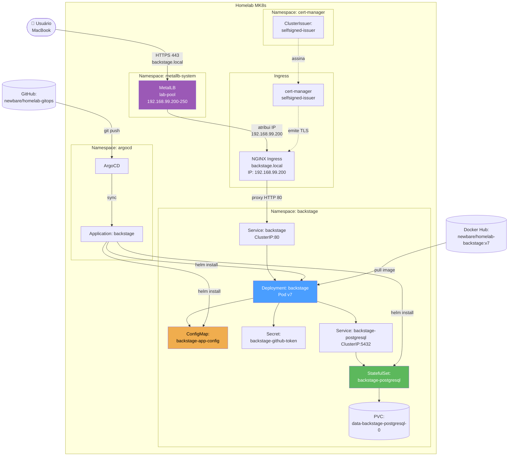
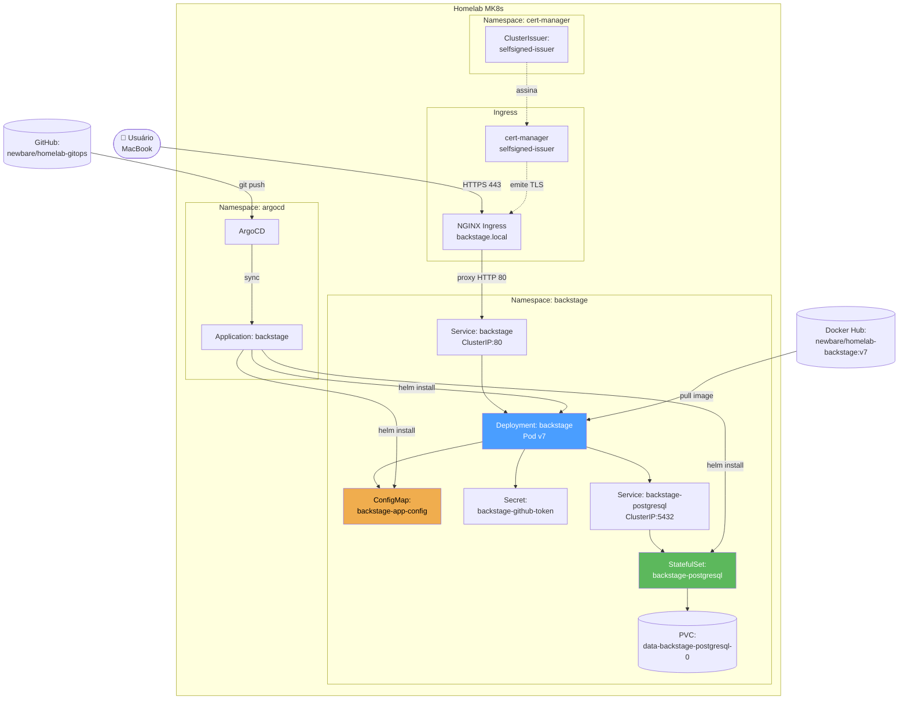
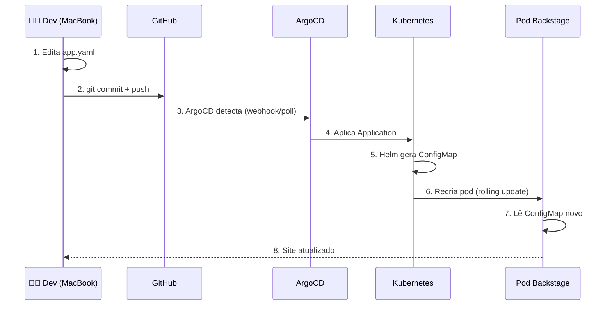

# Arquitetura — Backstage no Homelab MK8s

## 🗺️ Visão de alto nível

O Backstage roda como um **Deployment no namespace `backstage`**, atrás
de um **Ingress NGINX com TLS self-signed**, com estado persistido em
**PostgreSQL interno**.


    


## 🗺️ Visão de alto nível

O Backstage roda como um **Deployment no namespace `backstage`**, atrás
de um **Ingress NGINX com TLS self-signed**, com estado persistido em
**PostgreSQL interno**.



## 🧩 Componentes

### 1. Ingress (NGINX)

| Atributo | Valor |
|---|---|
| **Host** | `backstage.local` |
| **Classe** | `nginx` |
| **TLS** | `backstage-tls` (Secret) |
| **Annotations** | `backend-protocol: HTTP`, `force-ssl-redirect: true`, `proxy-body-size: 0` |
| **Backend** | `Service: backstage:80` |

**Responsabilidade:** terminação TLS, roteamento, headers.

### 2. MetalLB (LoadBalancer)

| Atributo | Valor |
|---|---|
| **Namespace** | `metallb-system` |
| **IPAddressPool** | `lab-pool` |
| **Range** | `192.168.99.200` a `192.168.99.250` (51 IPs) |
| **Arquivo** | `infrastructure/metallb/ipaddresspool.yaml` |
| **IP atribuído ao Ingress** | `192.168.99.200` |

**Responsabilidade:** atribuir IPs "externos" (da LAN) a Services do tipo
`LoadBalancer`. No homelab, o Ingress NGINX recebe `192.168.99.200`.

**Por que esse range:** o modem DHCP usa `192.168.99.1-199`; o MetalLB usa
`192.168.99.200-250`. **Sem sobreposição.**

**⚠️ Acoplamento:** se o IP do host MicroK8s mudar (DHCP), o
`/etc/hosts` do MacBook precisa ser atualizado.

### 3. TLS (cert-manager)

| Atributo | Valor |
|---|---|
| **Issuer** | `ClusterIssuer/selfsigned-issuer` |
| **Certificate** | `Certificate/backstage-tls` |
| **Secret** | `backstage-tls` (namespace `backstage`) |
| **DNS** | `backstage.local` |

**Responsabilidade:** gerar certificado auto-assinado pra `backstage.local`.

### 4. Backstage (Deployment)

| Atributo | Valor |
|---|---|
| **Nome** | `backstage` |
| **Replicas** | 1 |
| **Imagem** | `docker.io/newbare/homelab-backstage:v7` |
| **Porta** | `7007` (interno) |
| **Health checks** | `/.backstage/health/v1/liveness` e `readiness` |
| **Env** | `GITHUB_TOKEN` (via Secret `backstage-github-token`) |
| **Config** | Montado do ConfigMap `backstage-app-config` |

**Responsabilidade:** servir o app frontend + APIs internas.

### 5. ConfigMap `backstage-app-config`

| Atributo | Valor |
|---|---|
| **Gerado por** | Helm chart `backstage` (2.10.1) |
| **Fonte** | `spec.source.helm.values` do `Application` |
| **Conteúdo** | `app-config.yaml` (config em runtime) |
| **Chave importante** | `app.extensions` (define home na raiz + widgets) |

**⚠️ Ponto crítico:** o Backstage **não lê** o `app-config.yaml` empacotado na imagem. Ele lê **este ConfigMap**.

### 6. PostgreSQL (StatefulSet)

| Atributo | Valor |
|---|---|
| **Nome** | `backstage-postgresql` |
| **Imagem** | `bitnamilegacy/postgresql:15.4.0-debian-11-r10` |
| **PVC** | `data-backstage-postgresql-0` |
| **Secret** | `backstage-postgresql` |
| **Senha** | `backstage-lab-password` (no `app.yaml`) |

**Responsabilidade:** persistir catálogo, user settings, etc.

### 7. ArgoCD (GitOps)

| Atributo | Valor |
|---|---|
| **Application** | `argocd/backstage` |
| **Chart** | `backstage` (2.10.1) |
| **Repo** | `https://backstage.github.io/charts` |
| **Values** | Inline no `spec.source.helm.values` |
| **Sync Policy** | `automated: { prune: true, selfHeal: true }` |

**Responsabilidade:** sincronizar o estado do cluster com o `Application`.

## 🔄 Fluxo de deploy



## ⚠️ Pontos críticos

### 1. A fonte da verdade é o `Application` no cluster

O ArgoCD **não lê** o `app.yaml` do GitHub diretamente. Ele lê o **`Application` que está no cluster** (criado por `kubectl apply`). Por isso:

- Editar o `app.yaml` no Git **NÃO** atualiza o cluster sozinho
- Precisa de `kubectl apply -f infrastructure/backstage/app.yaml` **uma vez** pra propagar
- Depois disso, o **ArgoCD** regenera o ConfigMap

### 2. `app-config.yaml` do repo ≠ config do cluster

| Arquivo | Onde vive | Lido por |
|---|---|---|
| `apps/backstage/app-config.yaml` | Bundle Docker | `yarn dev` (local) |
| `appConfig` no `app.yaml` (Helm values) | ConfigMap | Pod no cluster |

**Se você editar o primeiro, NADA muda no cluster.** O segundo é o que vale.

### 3. Imagens imutáveis (`v7`)

Nunca usamos `latest`. Cada mudança de código gera uma tag nova (`v7`, `v8`, ...). Isso permite:
- Rollback fácil
- Rastreabilidade (qual versão está rodando)
- Cache de camadas no Docker Hub

### 4. ConfigMap tem `resourceVersion`

Toda mudança no ConfigMap incrementa `resourceVersion`. Se ele **não** muda após um sync, é sinal de que o Helm não detectou mudança nos values.

## 🔗 Dependências externas

| Dependência | Tipo | Onde |
|---|---|---|
| **Docker Hub** | Registry | `docker.io/newbare/homelab-backstage` |
| **GitHub** | Git + OAuth (futuro) | `github.com/newbare/homelab-gitops` |
| **Backstage Charts** | Helm chart | `backstage.github.io/charts` |
| **NGINX Ingress** | Controller | Namespace `ingress-nginx` |
| **cert-manager** | Controller | Namespace `cert-manager` |
| **ArgoCD** | GitOps | Namespace `argocd` |
| **MetalLB** | LoadBalancer | Namespace `metallb-system` |

## 🔗 Ver também

- [`00-contexto.md`](./00-contexto.md) — stack e ambiente
- [`02-jornada-fase-7.md`](./02-jornada-fase-7.md) — como chegamos aqui
- [`04-runbook.md`](./04-runbook.md) — operações comuns
```

---

## 🎯 Antes de commitar, valida

**Me diz:**

1. **O diagrama Mermaid está OK?** (visualiza bem ou quer mudar algo?)
2. **Os componentes estão certos?** (faltou algum? sobrou algum?)
3. **O fluxo de deploy está correto?**
4. **Os pontos críticos fazem sentido?**
5. **Tom tá bom?** (técnico, direto)

## ▶️ Depois que validar

```bash
cd ~/mk8s/homelab-gitops
nano docs/backstage/01-arquitetura.md
# (colar o conteúdo)

git add docs/backstage/01-arquitetura.md
git commit -m "docs(backstage): adiciona arquitetura (componentes + fluxo)"
git push
```

