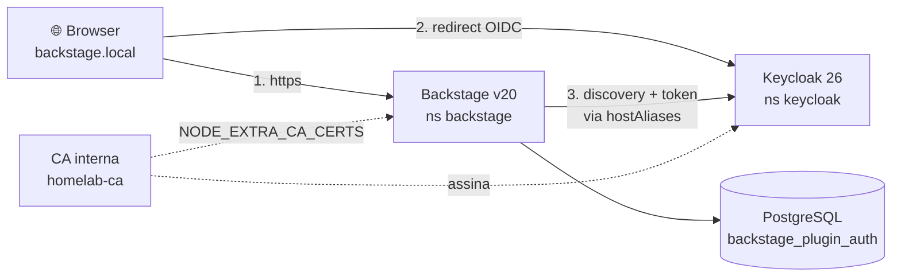

# Jornada — Fase 11 (Login OIDC do Backstage via Keycloak)

> Substitui o login `guest` por autenticação real contra o Keycloak do próprio
> homelab, usando OIDC. É o fechamento do ciclo das Fases 9c/10 (provisionar o
> Keycloak) com o portal (Fase 7).

**Data:** 2026-09-18
**Branch:** `feat/fase-11-backstage-oidc`
**Documentos relacionados:**
[`09-fase-9-floci-terraform-lambda.md`](./09-fase-9-floci-terraform-lambda.md) ·
[`../certificados/01-trust-anchor-interno.md`](../certificados/01-trust-anchor-interno.md) ·
[`../../infrastructure/backstage/README.md`](../../infrastructure/backstage/README.md)

---

## 🎯 Objetivo

Fazer o Backstage autenticar contra o **Keycloak** em vez do provider `guest`,
com a identidade do usuário resolvida para uma entidade do **catálogo**.

O ciclo completo que isso fecha:

```
Keycloak (identidade)  →  Backstage (portal)  →  catálogo (autorização futura)
```

---

## 🏗️ Arquitetura final



Dois detalhes que fazem o desenho fechar:

- O **browser** resolve `keycloak.local` pelo `/etc/hosts` do Mac.
- O **Pod** resolve pelo `hostAliases` (o Pod não vê o `/etc/hosts` do Mac).

---

## 🔍 Os seis achados (e o custo de cada um)

Esta fase não foi difícil por complexidade — foi difícil porque **quase todos os
pontos de falha eram silenciosos**. Registrando cada um: sintoma → causa → correção.

### 1. O config que nunca era lido

**Sintoma:** tentar configurar `catalog.locations` no `app-config.production.yaml`
da imagem não tinha efeito nenhum.

**Causa:** o chart Bitnami do Backstage **sobrescreve o `CMD`** do Dockerfile e
passa apenas um arquivo:

```
args: ["--config","/app/app-config-from-configmap.yaml"]
```

Logo, `app-config.yaml` e `app-config.production.yaml` **da imagem nunca são
lidos**. O único config ativo é o `ConfigMap` gerado do `appConfig` do `app.yaml`.

**Correção:** toda config nova passa a ser escrita no `appConfig` do
`infrastructure/backstage/app.yaml`.

**Como descobrir:** `kubectl get deploy backstage -n backstage -o jsonpath='{.spec.template.spec.containers[0].args}'`

---

### 2. O resolver certo (evitado por ler o código)

**Sintoma:** a documentação não deixa claro qual resolver usar, e o óbvio é o
`emailMatchingUserEntityProfileEmail`.

**Causa:** lendo `plugin-auth-node/dist/sign-in/commonSignInResolvers.cjs.js`,
o fallback desse resolver monta:

```js
const noPlusEmail = `${name}${domain}`;   // "fulano@example.com" — contém "@"
dangerousEntityRefFallback: { entityRef: { name: noPlusEmail } }
```

…um `entityRef` contendo `@` — **inválido** como nome de entidade do Backstage.

O `emailLocalPartMatchingUserEntityName` usa a parte local (`jefferson`), que é
um nome válido:

```js
const [localPart] = profile.email.split("@");   // "jefferson"
```

**Correção:** usar `emailLocalPartMatchingUserEntityName` **e** criar as entidades
`User` no catálogo — assim nem é preciso a flag `dangerously…`.

---

### 3. A pista falsa dos certificados de 90 dias

**Sintoma:** o backend não conseguia falar com `https://keycloak.local`
(`DEPTH_ZERO_SELF_SIGNED_CERT`).

**Primeira hipótese (minha) e por que estava errada:** eu assumi que o
certificado precisaria ter `CA:TRUE` para servir de âncora. Testei antes de agir:

```bash
node -e "fetch('https://keycloak.local/...').then(...).catch(...)"          # FALHOU
NODE_EXTRA_CA_CERTS=/tmp/keycloak-ca.crt node -e "fetch(...)"               # HTTP 200
```

**O Node aceita cert com `CA:FALSE` como âncora.** A teoria estava errada — o
teste de 2 segundos evitou uma reforma desnecessária.

**A causa real:** copiar o **certificado folha** (que rotaciona a cada 90 dias)
para o namespace `backstage`. A cópia ficaria obsoleta e o login quebraria
sozinho meses depois.

**Correção:** criar uma **CA interna estável** (`homelab-ca`, 10 anos) e copiar
*ela*, não a folha. A análise completa das 3 opções — e por que validade de 90
dias **não** é o problema — está em
[`../certificados/01-trust-anchor-interno.md`](../certificados/01-trust-anchor-interno.md).

---

### 4. `memberOf` é obrigatório (erro meu)

**Sintoma:** nenhum. O Pod subiu saudável, `HTTP 200`, e as entidades
simplesmente **não entraram no catálogo**.

**Causa:** eu criei os 4 `User` **sem `memberOf`**, supondo que mapear as roles
do Keycloak para `Group` era "decisão de política que poderia esperar". O schema
do Backstage **exige** o campo. O catálogo rejeitou todas:

```
Processor BuiltinKindsEntityProcessor threw an error while validating the
entity user:default/<parte-local>; caused by TypeError: /spec must have
required property 'memberOf' - missingProperty: memberOf
```

**Só apareceu no `kubectl logs`.** Nenhum `get` mostraria isso — o erro não é
"entidade inválida visível", é "entidade ausente".

**Correção:** 3 `Group` + `memberOf` em cada usuário, tudo versionado em
`infrastructure/backstage/catalog-users.yaml`.

**Lição:** depois de aplicar `catalog.locations`, **ler os logs do catálogo**. Ele
valida e reporta; o erro não aparece em nenhum `kubectl get`.

---

### 5. O `prompt=none` que impedia o primeiro login

**Sintoma:** o formulário do Keycloak nunca aparecia.

**Causa:** o default do Backstage é `prompt: none`:

```js
const prompt = initializedPrompt || "none";
if (prompt !== "auto") { options.prompt = prompt; }
```

Com `none`, o Keycloak **não mostra o formulário** quando não há sessão — devolve
erro ao callback. Comprovado seguindo o redirect sem sessão:

```
HTTP 302 → https://backstage.local/api/auth/oidc/handler/frame?error=login_required
```

Depois de `prompt: auto`:

```
HTTP 200 → <title>Sign in to resilience</title>
```

**Correção:** `prompt: auto`. Note que é um valor **especial**: o código faz
`if (prompt !== "auto")`, ou seja, `auto` **omite** o parâmetro e deixa o IdP
decidir — não é um valor repassado.

---

### 6. O Keycloak que se matava sozinho

**Sintoma:** o login falhava com `OPError: expected 200 OK, got: 503 Service
Unavailable`, e o pod do Backstage reportava `500`.

**Causa:** o **default do chart** para o liveness do Keycloak:

```yaml
livenessProbe:
  periodSeconds: 1        # checa a cada 1 segundo
  failureThreshold: 3     # ~15s sem responder -> MORTO
  initialDelaySeconds: 300
startupProbe:
  enabled: false
resourcesPreset: "small"  # que não se aplicou -> pod sem requests/limits
```

Num nó AMD A10 compartilhado com Prometheus, Grafana, Jaeger, Istio e
PostgreSQL, um engasgo de 15s acontece. E cada morte custa **1-3 minutos de 503**
no Ingress — ou seja, **todo login naquela janela falha**.

O `exit code 0` com `Reason: Completed` era a assinatura: não era crash, era
**SIGTERM** do kubelet após falha de liveness.

**Correção** (`infrastructure/keycloak/app.yaml`):

| Parâmetro | Antes | Depois |
|---|---|---|
| `livenessProbe.periodSeconds` | 1 | 10 |
| `livenessProbe.failureThreshold` | 3 | 6 (~60s de tolerância) |
| `readinessProbe.timeoutSeconds` | 1 | 5 |
| `startupProbe.enabled` | `false` | `true` (30 × 10s = 5 min de boot) |
| `requests` | *(vazio)* | `cpu 250m` / `memory 512Mi` |
| `limits` | *(vazio)* | `cpu 1` / `memory 1Gi` |

**Lição de diagnóstico:** `exit 0` + `Reason: Completed` + restarts recorrentes
= **kubelet matando**, não aplicação quebrando. Um `CrashLoopBackOff` por bug
teria `exit != 0`.

---

## 🔧 Implementação

### Código do Backstage

| Arquivo | Mudança |
|---|---|
| `packages/backend/package.json` | `+ @backstage/plugin-auth-backend-module-oidc-provider` |
| `packages/backend/src/index.ts` | `backend.add(import('@backstage/plugin-auth-backend-module-oidc-provider'))` |
| `packages/app/package.json` | `+ @backstage/core-app-api` (era dependência fantasma) |
| `packages/app/src/modules/auth/authModule.tsx` | **novo** — `keycloakAuthApiRef` + `ApiBlueprint` + `SignInPageBlueprint` |
| `packages/app/src/App.tsx` | registra o `authModule` |

O ponto que a doc oficial destaca e que é fácil errar:

> o `provider.id` passado a `OAuth2.create` **precisa** ser `'oidc'` — é o nome
> que o backend registra. `'Keycloak'` é apenas o rótulo exibido.

### Imagem

```bash
cd apps/backstage
yarn tsc                # 16s, exit 0
yarn build:backend      # "Building app separately because it is a bundled package"
cd ../..
DOCKER_BUILDKIT=1 docker build -t newbare/homelab-backstage:v20 \
  -f packages/backend/Dockerfile .
docker push newbare/homelab-backstage:v20
```

> O `Dockerfile` é **single-stage** e não compila: ele exige `yarn tsc` +
> `yarn build:backend` **antes**.

### Infraestrutura

| Arquivo | Papel |
|---|---|
| `infrastructure/cert-manager/ca.yaml` | **novo** — `Certificate homelab-ca` + `ClusterIssuer homelab-ca-issuer` + `Bundle` |
| `infrastructure/cert-manager/ca-app.yaml` | **novo** — Application (`prune: false`) |
| `infrastructure/trust-manager/app.yaml` | **novo** — Application do trust-manager, que distribui a CA |
| `infrastructure/backstage/scripts/generate-catalog.py` | **novo** — gera o `ConfigMap` de usuários (dado pessoal: não versionado) |
| `infrastructure/keycloak/app.yaml` | annotation → `homelab-ca-issuer`; probes e resources |
| `infrastructure/backstage/app.yaml` | v20, hostAliases, volumes, OIDC, catalog |

### Segredos

| Secret (ns `backstage`) | Chave | Origem |
|---|---|---|
| `backstage-keycloak` | `KEYCLOAK_CLIENT_SECRET` | provisioner do Keycloak (Fase 10) |
| `backstage-auth-session` | `AUTH_SESSION_SECRET` | `openssl rand -hex 32` |

```bash
kubectl -n backstage create secret generic backstage-auth-session \
  --from-literal=AUTH_SESSION_SECRET="$(openssl rand -hex 32)" \
  --dry-run=client -o yaml | kubectl apply -f -
```

> O `openssl rand | kubectl apply` evita que o valor apareça na tela ou no
> histórico do shell (onde ficaria visível em `ps` para outros usuários).

---

## ✅ Validação (com as saídas reais)

### A CA é uma CA de verdade

```
subject=CN=homelab-ca          notAfter=Sep 15 19:18:59 2036 GMT
X509v3 Basic Constraints: critical
    CA:TRUE
X509v3 Key Usage: critical
    Digital Signature, Key Encipherment, Certificate Sign
/tmp/homelab-ca.crt: OK
```

### A folha de `keycloak.local` fecha cadeia com ela

```bash
openssl verify -CAfile /tmp/homelab-ca.crt /tmp/keycloak-leaf.crt
```

```
/tmp/keycloak-leaf.crt: OK
```

Antes da troca o mesmo comando dava `error 18 … self-signed certificate`.

> ⚠️ Três sinais que **parecem** provar a reemissão e não provam: a annotation no
> Ingress, `READY: True` no `Certificate` e o `AGE` do objeto. O `AGE` é a idade
> do **objeto**, não do certificado — o cert-manager atualiza o Secret no lugar.
> Detalhes em [`../certificados/01-trust-anchor-interno.md`](../certificados/01-trust-anchor-interno.md), seção 7.2.

### O Pod fala com o Keycloak

```
/etc/homelab-ca/ca.crt               <- montado (ConfigMap criado pelo trust-manager)
/etc/backstage-catalog/users.yaml    <- montado (ConfigMap provisionado)
NODE_EXTRA_CA_CERTS=/etc/homelab-ca/ca.crt
HTTP 200                             <- fetch do Pod para keycloak.local
```

O **controle negativo válido** — mesmo fetch, num subprocesso **sem** a variável:

```bash
kubectl -n backstage exec deploy/backstage -- \
  env -u NODE_EXTRA_CA_CERTS node -e "fetch('https://keycloak.local/...')..."
```

```
como esperado, falhou: UNABLE_TO_VERIFY_LEAF_SIGNATURE
```

> ⚠️ Limpar `process.env.NODE_EXTRA_CA_CERTS` **de dentro** do processo **não** é
> controle válido: o Node lê essa variável apenas na inicialização. O primeiro
> teste que eu fiz assim devolveu `HTTP 200` e não provava nada. Detalhes na
> seção 7.3.1 de
> [`../certificados/01-trust-anchor-interno.md`](../certificados/01-trust-anchor-interno.md).

### O catálogo aceitou as entidades

```
 location:default/generated-9b4e2784f7575f8de99eaf63c114fde1a8390649
 group:default/resilience-admins
 group:default/resilience-devs
 group:default/resilience-viewers
 user:default/<parte-local-do-email>   x4     (nomes omitidos — estão no users.csv)
(8 rows)
```

### O backend monta o redirect correto

```
HTTP/2 302
location: https://keycloak.local/realms/resilience/protocol/openid-connect/auth
  ?client_id=backstage
  &redirect_uri=https%3A%2F%2Fbackstage.local%2Fapi%2Fauth%2Foidc%2Fhandler%2Fframe
  &code_challenge=...&code_challenge_method=S256     <- PKCE ativo
  &state=...&nonce=...
```

### A tela de login

```
- generic: Keycloak
- paragraph: Entrar com Keycloak
- button "Sign In"
```

---

## 🧪 Como testar cada usuário (sem falso positivo)

⚠️ **Sem `prompt` rígido, o Keycloak reaproveita a sessão SSO.** Logar como
`jefferson` e depois tentar `maria` na mesma janela entra como jefferson — e
parece que funcionou.

Use **uma janela anônima por usuário**.

**Os nomes e e-mails reais NÃO ficam neste documento.** Eles vivem em
`infrastructure/keycloak/scripts/data/users.csv`, que é ignorado pelo Git — a
mesma fonte que gera o catálogo do Backstage (ver
[`../../infrastructure/backstage/scripts/README.md`](../../infrastructure/backstage/scripts/README.md)).
Este repositório é público; nome e e-mail de pessoa são dado pessoal.

Como os campos se relacionam:

| Campo | Onde vem | Exemplo (fictício) |
|---|---|---|
| `username` | coluna `username` do CSV | `fulano.silva` |
| **login no Backstage** | coluna `email` | `fulano@example.com` |
| **`metadata.name` da entidade** | parte **local** do e-mail | `fulano` |
| role no Keycloak | coluna `role` | `resilience-devs` |

Para listar os reais, use o próprio CSV:

```bash
column -t -s, infrastructure/keycloak/scripts/data/users.csv
```

> ⚠️ **O login é o e-mail**, e a entidade do catálogo é a **parte local** dele —
> **não** o `username`. O resolver faz isso literalmente:
> `profile.email.split("@")[0]`. No exemplo acima, `fulano.silva` não é nome de
> entidade válido para o login; `fulano` é.

**A senha inicial** é o `KEYCLOAK_TEMP_PASSWORD` **exportado ao rodar o
provisioner** — e isso é diferente do valor de exemplo.

> ⚠️ **Não presuma a senha a partir do README.** O `Mudar@123` que aparece em
> [`../../infrastructure/keycloak/scripts/README.md`](../../infrastructure/keycloak/scripts/README.md)
> é apenas um exemplo de `export KEYCLOAK_TEMP_PASSWORD`. O código **não tem
> valor padrão**: `_env("KEYCLOAK_TEMP_PASSWORD")` é `required=True,
> default=None`, e sem a variável o script aborta com exit 1. O valor que vale é
> o que foi realmente exportado naquela execução.
>
> Para descobrir o que está aplicado, **teste** em vez de supor. Com
> `UPDATE_PASSWORD` pendente, o endpoint de token distingue os casos:
>
> | Resposta | Significado |
> |---|---|
> | `400` — `Account is not fully set up` | senha **correta**, troca pendente |
> | `401` — `Invalid user credentials` | senha **errada** |
> | `200` — token emitido | senha correta **e** sem troca pendente |
>
> ```bash
> curl -s -o /dev/null -w '%{http_code}\n' \
>   -d grant_type=password -d client_id=admin-cli \
>   -d username=<username> --data-urlencode 'password=<senha>' \
>   https://keycloak.local/realms/resilience/protocol/openid-connect/token
> ```
>
> Tudo isso exige `directAccessGrantsEnabled: true` no client — o provisioner
> liga essa flag no client `backstage` (`ensure_client`), e o `admin-cli` já vem
> com ela.
>
> ⚠️ **Comparar hash não serve para isso.** As credenciais são `argon2` com salt
> aleatório por credencial, então senhas **iguais** produzem hashes
> **diferentes** — e o tamanho do hash é constante da instância, igual para todo
> mundo. A única prova de igualdade de senha é autenticar.

**Confirmando pelo banco** (não pela tela):

```bash
kubectl -n postgresql exec statefulset/postgresql -- \
  psql -U postgres -d backstage_plugin_auth -c "select user_entity_ref from user_info;"
```

Esperado: **uma linha distinta por usuário**, no formato
`user:default/<parte-local-do-email>`.

O teste só vale se aparecerem **N** linhas distintas para **N** usuários. Se o
mesmo `entity_ref` repetir, o Keycloak reaproveitou a sessão SSO e o teste não
valou — é exatamente o falso positivo que a janela anônima evita.

---

## 🚧 Becos sem saída (o que NÃO funcionou)

### 1. Split-horizon de endpoints OIDC

Usar URL interna para o backend e pública para o browser é **impossível**: o
provider OIDC do Backstage aceita **só `metadataUrl`** — não há
`authorizationUrl`/`tokenUrl` para sobrescrever.

### 2. Deduzir do código sem testar

A hipótese `CA:TRUE` (achado 3) parecia sólida e estava errada. O teste de 2
segundos resolveu o que a leitura de X.509 não resolveria.

### 3. Confiar no `AGE` do `Certificate`

Já descrito acima — sinal que não responde à pergunta feita.

### 4. Um segundo bloco `resources:` no YAML

Ao adicionar `resources` ao `app.yaml` do Keycloak, eu **inseri um bloco sem ler
o arquivo inteiro** — já existia outro ao final. YAML com chave duplicada **não
dá erro**: a última vence, silenciosamente. Vale como lembrete de que
"editar" exige ler o arquivo todo, não só o trecho.

---

## 📌 Pendências e backlog

| Item | Observação |
|---|---|
| **Aplicar as Applications pós-merge** | `ca-app.yaml` aponta para `main` — só funciona depois do merge. `keycloak-ca-app.yaml` e `catalog-users-app.yaml` **deixaram de existir** (ver abaixo) |
| ~~CA hardcoded~~ **RESOLVIDO** | `keycloak-ca.yaml` foi **apagado**. A CA é distribuída pelo **trust-manager** (`Bundle` no fim de `ca.yaml`); nenhum valor gerado pelo cluster ficou no Git. Ver seção 10 de [`../certificados/01-trust-anchor-interno.md`](../certificados/01-trust-anchor-interno.md) |
| ~~Duas fontes de usuários~~ **RESOLVIDO** | agora há **uma** fonte: o `users.csv`. O catálogo do Backstage é **gerado** dele por `infrastructure/backstage/scripts/generate-catalog.py` |
| **Usuários fora do Git** | o `ConfigMap` de usuários é provisionado por comando, **não** pelo ArgoCD — é o único passo não puramente GitOps, por conter dado pessoal. Trade-off e alternativas em [`../../infrastructure/backstage/scripts/README.md`](../../infrastructure/backstage/scripts/README.md) |
| **`sync-wave` de CA/trust-manager** | estavam **invertidas**: trust-manager (3) vinha antes do cert-manager (4), que ele **consome** para o TLS do próprio webhook. Corrigidas para cert-manager (4) → trust-manager (5) → ca (6) |
| **Permissões/RBAC** | Os `Group` existem para satisfazer o schema e refletir as roles do Keycloak. **Não concedem nenhuma permissão** ainda |
| **`ensure_user` é create-only** | Re-rodar o provisioner **não** reseta senha de usuário existente. Reset é pelo console |
| **Keycloak sem `resourcesPreset` aplicado** | O default do chart não se aplicou (chart 24.4.0 vs defaults do `main`). Agora está explícito |
| **`selfsigned-issuer` nos demais hosts** | `backstage.local`, `argocd.local`, etc. ainda são auto-assinados independentes. Migrar para `homelab-ca-issuer` removeria os avisos de todos |
