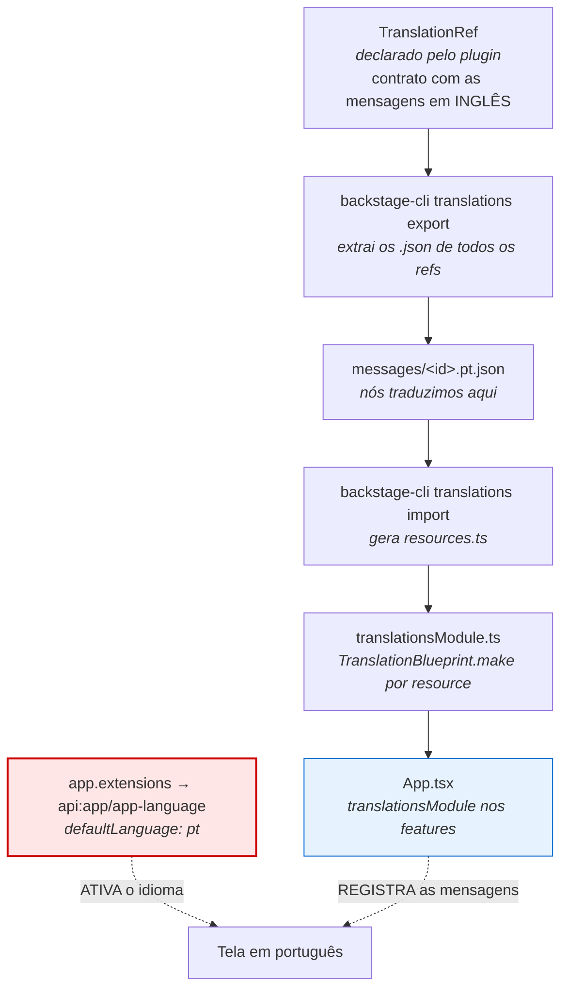

# Jornada — Fase 12 (Backstage em português: i18n pt-BR)

> Traduzir a interface do portal sem fork de plugin e sem patch em
> `node_modules` — usando o sistema de i18n nativo do Backstage e ativando o
> idioma por configuração.

**Data:** 2026-09-18
**Branch:** `feat/i18n-pt-br`
**Documentos relacionados:**
[`10-fase-11-backstage-oidc.md`](./10-fase-11-backstage-oidc.md) ·
[`05-troubleshooting.md`](./05-troubleshooting.md) ·
[`../../infrastructure/backstage/README.md`](../../infrastructure/backstage/README.md)

---

## 🎯 Objetivo

O portal estava 100% em inglês. A meta era traduzir para **pt-BR** de forma
**sustentável**: que sobrevivesse a upgrade de plugin e não exigisse reescrever
código de terceiros.

Duas coisas tornam isso mais sutil do que parece, e são a espinha dorsal deste
documento:

1. **Traduzir é registrar; aparecer é ativar.** São duas etapas independentes, e
   a segunda falha **em silêncio**.
2. O Backstage **não tem traduções prontas**. Nenhuma. Quem quiser outro idioma
   fornece as mensagens.

---

## 🧠 Modelo mental: como o i18n do Backstage funciona

Antes de qualquer comando, o desenho. Sem ele, os erros desta fase parecem
aleatórios.



**A parte vermelha é a que engana.** Registrar as mensagens (azul) não faz nada
sozinho: o idioma **usado** é decidido pela API `appLanguageApiRef`, cujo default
é `en`. Sem a configuração, os resources ficam carregados na memória e **nunca
consultados**.

Uma analogia: traduzir é **imprimir o dicionário e colocar na estante**.
Configurar é **escolher o idioma do dicionário que se abre**. Só a primeira parte
produz uma estante bonita e uma tela em inglês.

---

## 🏗️ O que foi montado

| Arquivo | Origem | Papel |
|---|---|---|
| `packages/app/translations/manifest.json` | `translations export` | índice: 18 refs, 873 mensagens |
| `packages/app/translations/messages/*.en.json` | `translations export` | 18 arquivos em inglês (referência) |
| `packages/app/translations/messages/*.pt.json` | **escritos à mão** | **18 arquivos, 873 mensagens** — todos os refs |
| `packages/app/src/translations/resources.ts` | `translations import` | liga cada ref ao `.pt.json` |
| `packages/app/src/modules/translations/translationsModule.ts` | escrito à mão | registra os resources no plugin `app` |
| `packages/app/src/modules/translations/index.ts` | escrito à mão | barrel |
| `packages/app/src/App.tsx` | editado | inclui `translationsModule` nos features |
| `infrastructure/backstage/app.yaml` | editado | **ativa** `pt` via `app.extensions` |

Os arquivos em `packages/app/translations/` **não são gitignored** e vão para o
Git — é a convenção do Backstage. São eles que permitem detectar, num upgrade,
**qual mensagem nova apareceu e ainda não tem tradução**.

Imagem publicada: `newbare/homelab-backstage:v23`.

---

## 🔍 Os gaps (sintoma → causa → correção)

Nenhum destes veio de documentação lida de antemão. Cada um custou uma
investigação. Registrando na ordem em que apareceram.

### 1. O comando `export` roda *dentro* do package

**Sintoma:** rodar `yarn backstage-cli translations export` na raiz não gera nada
de útil.

**Causa:** o CLI do Backstage precisa do `package.json` do **package** para
saber onde gravar.

**Correção:**

```bash
cd apps/backstage/packages/app
yarn backstage-cli translations import     # gera/atualiza resources.ts no package atual
```

---

### 2. O escopo é por *ref*, não pela tela

**Sintoma:** depois de tudo montado, a **tela de login continuava em inglês**
("Sign In", "Enter your email").

**Causa:** não é falha. Traduzimos os refs `home` e `home-react`. A tela de
login usa strings de `@backstage/core-components` (ref de 56 mensagens) e do
plugin `app` — refs **diferentes**, que não foram traduzidos.

**O que isso ensina:** tradução no Backstage é **granular por plugin**. Não
existe "ativar pt-BR" global que traduza tudo. Cada ref é um bloco.

---

### 3. `TranslationBlueprint` não mora onde o nome sugere

**Sintoma:** `import { TranslationBlueprint } from '@backstage/frontend-plugin-api'`
→ não existe.

**Causa:** ele vive em **`@backstage/plugin-app-react`**. Faz sentido depois que
se entende o gap 5: as traduções pertencem ao plugin `app`.

**Como descobrir rápido** (melhor que ler doc):

```bash
grep -rl 'TranslationBlueprint' --include='*.d.ts' node_modules/@backstage/ | head
```

---

### 4. `duplicate extensions: translation:app` — o erro que `tsc` não pega

**Sintoma:** `tsc` exit 0, `yarn build:backend` OK, imagem publicada, ArgoCD
`Synced`/`Healthy`, pod `1/1 Running` — e a tela **branca**, sem nada em
`kubectl logs`.

**Onde estava o erro:** apenas no **console do navegador**:

```
Error: Module 'app' provided duplicate extensions: translation:app
```

**Causa:** a primeira versão do módulo era

```ts
resources.map(resource => TranslationBlueprint.make({ params: { resource } }))
```

Sem `name`, o id da extensão é `<kind>:<pluginId>` — **igual para todos**. Com
dois refs, o app tenta registrar duas extensões chamadas `translation:app` e
recusa subir.

**Correção:** derivar o `name` do `id` que o próprio resource já carrega:

```ts
TranslationBlueprint.make({
    name: resource.id,      // home, home-react → translation:app/home, ...
    params: { resource },
})
```

**⚠️ Lição (custou 1 hora):** `tsc` passar **não** significa que o app sobe.
Erro de extensão duplicada é de **runtime** e mora no browser. O processo Node do
backend segue saudável, então `kubectl logs` não mostra nada.

Diagnóstico correto quando a tela fica branca e os pods estão saudáveis:
**abrir o console do navegador**, não o log do pod.

---

### 5. 🔴 O gap central: **registrado ≠ ativo**

**Sintoma:** este é o "a tradução eu não estou vendo". Tudo registrado, bundle
com as strings em português dentro, `Synced`/`Healthy` — e a tela em inglês.

**Causa:** o idioma usado é decidido pela API `appLanguageApiRef`, instanciada em
`@backstage/plugin-app/dist/extensions/AppLanguageApi.esm.js`:

```js
const AppLanguageApi = ApiBlueprint.makeWithOverrides({
  name: "app-language",
  configSchema: {
    defaultLanguage: z.string().optional(),
    availableLanguages: z.array(z.string()).optional(),
  },
  ...
});
```

O `configSchema` está aí: existe **configuração**, e o default é `en`. Como
nenhuma config foi fornecida, o app lia `en` e ignorava os recursos de `pt`.

**Correção** — em `infrastructure/backstage/app.yaml`, dentro do `appConfig`,
**antes** de `- page:home:`:

```yaml
app:
  extensions:
    - api:app/app-language:
        config:
          defaultLanguage: pt
          availableLanguages: [pt, en]
    - page:home:
        ...
```

O id `api:app/app-language` segue o padrão `<kind>:<pluginId>[/<name>]` — o mesmo
das outras entradas ali (`api:home/visits`, `page:home`).

**Como eu descobri:** grepar o que o próprio plugin declara, em vez de supor:

```bash
grep -rn 'appLanguageApiRef' node_modules/@backstage/frontend-plugin-api/dist/index.d.ts
```

**⚠️ Lição:** um resource registrado e nunca consultado é indistinguível de um
resource que não existe. Quando a tradução "não aparece", o suspeito nº 1 é a
**ativação**, não o conteúdo.

---

### 6. `localStorage` vence o `defaultLanguage` (o gap que travou a verificação)

**Sintoma:** após aplicar a config e reiniciar, a tela continuava em inglês. Já
ia concluir que o id `api:app/app-language` estava errado.

**Causa:** o `AppLanguageSelector.createWithStorage` **persiste** o idioma
escolhido no `localStorage`, e o valor salvo tem **precedência sobre o default**.
O navegador tinha `language = en` gravado de uma visita anterior à config.

Verificação no console do navegador:

```js
localStorage.getItem('language')     // "en"   ← valor velho vencendo o default
```

Depois de limpar e recarregar:

```js
localStorage.clear()
// recarrega a página
localStorage.getItem('language')     // "pt"   ✅ a config É lida
```

**Consequência operacional (importante):**

> `defaultLanguage: pt` só vale para quem **nunca** acessou o portal, ou para
> quem limpar o storage. **Quem já usava o portal fica em inglês** até trocar
> manualmente.

**A válvula de escape** é o próprio `availableLanguages: [pt, en]`: ele cria o
**seletor de idioma em Settings**. Foi assim que o usuário resolveu na prática —
*"tem um botão no settings que muda o idioma!"*.

Por isso os dois parâmetros andam juntos: `defaultLanguage` define o ponto de
partida, `availableLanguages` dá a saída para quem já tem valor salvo.

---

### 7. `grep` por acento no bundle dá **falso negativo**

**Sintoma:** grepar `Restaurar padrão` no bundle minificado retornava **zero** —
parecia que a tradução não tinha entrado no build.

**Causa:** o minificador **escapa** não-ASCII. A string está lá, escrita
`Restaurar padr\xe3o`.

**Como verificar corretamente:**

```bash
grep -c 'Restaurar padr' bundle.js            # 0  ← falso negativo
grep -c 'Restaurar padr.xE3o' bundle.js       # 1  ← com escape
grep -c 'Configura\xe7\xf5es' bundle.js       #    ← ç õ
```

**⚠️ Lição:** ausência de evidência por `grep` mal feito não é evidência de
ausência. Antes de concluir "não entrou no build", confirmar **como** o dado
apareceria.

---

### 8. O `react-aria` tem o **seu próprio** i18n (não confundir)

**Sintoma:** no canto da tela apareceu `"0 notificação."` — em português, antes
mesmo de qualquer tradução nossa funcionar. E `"1 notificação"`/`"2 notificações"`
mudando sozinho.

**Causa:** `react-aria-components` (dependência transitiva do scaffolder) traz
i18n **próprio** em `.../react-aria-components/i18n/pt-BR.js`, escolhido
**automaticamente pelo locale do navegador**. Nada a ver com o nosso módulo.

**⚠️ Lição:** string em português na tela **não é prova** de que a nossa
tradução está ativa. Pode ser outro sistema de i18n agindo por conta própria.
Só contar como evidência o que é chave do **nosso** ref.

---

### 9. `rollout restart` foi desnecessário (e briga com o ArgoCD)

**Sintoma:** mudei o `appConfig`, sincronizei, e o pod **não** reiniciou —
parecia que a config só valeria após reinício manual.

**Causa real:** o chart do Backstage já injeta um **checksum** do config no pod
template:

```
annotations:
  checksum/app-config: 4dca6063e5f209a1b1e6cfbbaa67627d6dc08fbd558769722bf7961f83a28baf
```

Mudou o config → o checksum muda → **o ReplicaSet novo nasce sozinho**. Eu li o
estado cedo demais (antes do sync terminar) e concluí que não reiniciava.

Meu `kubectl rollout restart` foi, além de inútil, **prejudicial**: ele adiciona
`kubectl.kubernetes.io/restartedAt` ao pod template, e o ArgoCD tem
`selfHeal: true` — ou seja, ia reverter e reiniciar o pod de novo em momento
aleatório. Desfiz com:

```bash
kubectl -n backstage patch deploy backstage --type json \
  -p '[{"op":"remove","path":"/spec/template/metadata/annotations/kubectl.kubernetes.io~1restartedAt"}]'
```

**⚠️ Lição:** em GitOps com `selfHeal`, **não se mexe no cluster para corrigir o
que o Git deveria corrigir**. O cluster seria reconciliado de qualquer forma — e
a intervenção manual vira drift. E "o pod não reiniciou" precisa ser medido
**depois** do sync concluir, não durante.

---

### 10. `curl` do macOS ignora `--cacert` e falha com mensagem enganosa

**Sintoma:** `curl https://backstage.local/` → `connect` estourando em 5s,
`http_code=000`, e o texto mencionando *"establish a secure connection"*.
Parecia DNS ou rede.

**Causa:** o `curl` do macOS usa **SecureTransport** e valida contra o Keychain,
não contra `--cacert`. A mensagem real era:

```
curl: (60) SSL: couldn't get X509-issuer name
```

A rede estava **perfeita**: a prova foi `curl -k` devolvendo **HTTP 200**.

**Como testar TLS de verdade no macOS:**

```bash
curl -sk -o /dev/null -w '%{http_code}\n' https://backstage.local/   # -k: rede está OK?
python3 -c "import ssl,socket; ..."                                  # validação real da cadeia
```

**⚠️ Lição:** `000` no curl não é diagnóstico. Separar **rede** (`-k`) de
**confiança TLS** antes de investigar qualquer um dos dois.

---

### 11. Popup do OIDC não funciona no navegador automatizado

**Sintoma:** ao tentar validar a tradução, o login não avançava. A tela dizia,
em inglês: **"Login failed, popup was closed"**.

**Causa:** o fluxo OIDC do Backstage abre uma **janela via `window.open`** e
monitora `popup.closed`. Instrumentando o `window.open` deu para ver que o
popup era criado (`janela-aberta`) mas **fechado imediatamente** — o navegador
automatizado não materializa a janela como página controlável. Logo, o app
conclui "popup fechado" e aborta.

**Não é bug do portal.** No navegador real do usuário o login funciona.

**Contorno para verificar sem popup:** o endpoint aceita outro `flow`:

```bash
for f in pop redirect; do
  curl -sk -o /dev/null -w "flow=$f -> %{http_code} %{redirect_url}\n" \
    "https://backstage.local/api/auth/oidc/start?scope=openid%20profile%20email&origin=https%3A%2F%2Fbackstage.local&env=production&flow=$f"
done
```

Ambos devolvem **302** para o Keycloak. Com `flow=redirect` dá para completar o
login em **uma única aba**, sem popup — foi assim que a validação visual foi
possível.

**Bônus do diagnóstico:** o `400` inicial do `/start` era só
`Must specify 'env' query to select environment` — a URL capturada tinha sido
truncada em 120 caracteres por mim e o `&env=production` do fim ficou de fora.
**Truncar log é uma forma silenciosa de inventar bug.**

---

## ✅ Como ficou na tela

Verificado com login real, em `/`, `/settings` e `/catalog`, com
`localStorage.language = pt`.

### Traduzido

| Tela | O que ficou em português |
|---|---|
| **Home** | `EDITAR`, `Clique na estrela ao lado do nome…`, `VER MAIS`, `há 0 segundo` / `há 3 minutos` |
| **Settings** | `Perfil`, `Aparência`, `Tema` / `Alterar o modo do tema`, `Escuro` / `Claro` / `Automático`, `Idioma` / `Alterar o idioma`, `Fixar barra lateral`, `Identidade no Backstage`, `Entidade de usuário:` |
| **Catálogo** | `Catálogo Backstage`, `Criar`, `FILTROS`, colunas `NOME` / `SISTEMA` / `RESPONSÁVEL` / `TIPO` / `CICLO DE VIDA` / `DESCRIÇÃO` / `TAGS` / `AÇÕES`, `Nenhum registro para exibir`, tooltips `Página anterior` / `Próxima página` |
| **Busca** | `Buscar`, `Buscar em …` |
| **Global** | seletor de idioma em Settings (`Português`), `Pular para o conteúdo` |

### Continua em inglês — e não é falha de tradução

Duas categorias distintas. Vale separar, porque só uma tem conserto por arquivo.

**(a) Títulos de extensão — literais no código do plugin, sem chave de tradução**

O menu lateral (`Home`, `Catalog`, `Create`, `APIs`, `Catalog Graph`, `Docs`,
`Register Existing Component`, `Notifications`, `Visualizer`, `Settings`), os
títulos das páginas (`Catalog`, `Settings`), as abas (`General`,
`Authentication Providers`, `Feature Flags`) e os títulos dos cartões da home
(`Toolkit`, `World Clocks`, `Random Joke`, `Most Visited`, `Recently Visited`,
`Your Starred Entities`).

```js
// @backstage/plugin-home/dist/alpha.esm.js
name: "HomePageToolkit",
title: "Toolkit",            // literal — NÃO é `titleKey`
```

Confirmações:

```bash
grep -rn 'titleKey' --include='*.d.ts' node_modules/@backstage/   # zero resultados
# core.title não tem schema de config:
#   title: createExtensionDataRef().with({ id: "core.title" })   → tipo de config {}
```

Ou seja: `app.extensions` **não** consegue sobrescrever título (aceita apenas
`attachTo`, `disabled` e `config`). `createExtensionOverrides` foi removido em
v0.9.0; a API que existe hoje é `withOverrides`, que exigiria re-declarar
extensão por extensão.

**⚠️ E aqui está a armadilha:** alguns refs contêm chaves de título que o
**novo frontend system simplesmente não usa** — sobraram do sistema clássico.
Traduzimos `settingsLayout.title`, `defaultSettingsPage.tabsTitle.general` e
`defaultSettingsPage.tabsTitle.authProviders`, e a tela continua mostrando
`Settings`, `General` e `Authentication Providers`. **Traduzir a chave certa não
garante que ela seja lida.**

**(b) Strings de terceiros / formatação própria**

- `CLEAR`, `REROLL`, `All components (0)`, `9 times` — rótulos internos do
  plugin, sem chave.
- `Previous Page` / `Next Page` nos botões de paginação: o **tooltip** veio do
  nosso ref (`Página anterior`), mas o `aria-label` do botão é default do MUI.
- Conteúdo do cartão *Getting Started* na home: é **texto nosso**, escrito no
  `appConfig` — traduz-se editando o `app-config`, não por i18n.

### Veredito

A tradução por ref funciona e cobre **todo o conteúdo** (rótulos de tabela,
botões, descrições, estados vazios, diálogos, formulários). Os **títulos de
navegação** ficam fora do sistema de i18n do Backstage nesta versão.

---

## 🔁 Receita: traduzir um ref novo

```bash
cd apps/backstage/packages/app

# 1. Extrair os .en.json de todos os refs (regenera o manifest + os arquivos)
yarn backstage-cli translations export

# 2. Ver o que existe e quantas mensagens cada ref tem — NÃO estimar
jq -r '.refs[] | "\(.id)  \(.messageCount)"' translations/manifest.json | sort

# 3. Traduzir: copiar messages/<id>.en.json → messages/<id>.pt.json
#    ⚠️ Paridade de chaves é obrigatória: mesmo número, mesmos nomes.

# 4. Conferir paridade antes de seguir (erro aqui = string em inglês silenciosa)
diff <(jq -S 'keys' translations/messages/<id>.en.json) \
     <(jq -S 'keys' translations/messages/<id>.pt.json) && echo "OK"

# 5. Registrar (regenera src/translations/resources.ts)
yarn backstage-cli translations import
```

O `translationsModule.ts` **não precisa ser editado** — ele itera o array
gerado. O `app.yaml` também não, desde que o idioma já esteja ativo.

### Build e deploy (sempre a partir de `apps/backstage`)

```bash
cd apps/backstage

yarn install --immutable
yarn tsc                        # type-check primeiro — barato, e pega erro antes do build
yarn build:backend              # gera skeleton.tar.gz + bundle.tar.gz
                                # ("Building app separately because it is a bundled package")

DOCKER_BUILDKIT=1 docker build \
  -t newbare/homelab-backstage:vNN \
  -f packages/backend/Dockerfile .
docker push newbare/homelab-backstage:vNN

# atualizar a tag no manifesto e aplicar
cd -
sed -i '' 's|homelab-backstage:vNN-1|homelab-backstage:vNN|' infrastructure/backstage/app.yaml
kubectl apply -f infrastructure/backstage/app.yaml      # OBRIGATÓRIO: Application de chart
kubectl -n argocd patch application backstage --type merge -p '{"operation":{"sync":{}}}'
kubectl -n argocd wait --for=jsonpath='{.status.operationState.phase}'=Succeeded application/backstage --timeout=300s
kubectl -n backstage rollout status deploy/backstage --timeout=480s
```

> ⚠️ `yarn build:backend` **antes** do `docker build` — o Dockerfile consome
> `packages/backend/dist/*.tar.gz`. Sem isso o build falha reclamando do
> `bundle.tar.gz`.

> ⚠️ `rollout status` pode responder "successfully rolled out" **na revisão
> anterior** se você rodar cedo demais. Sempre conferir a imagem do pod depois:
> `kubectl -n backstage get pods -o custom-columns='POD:.metadata.name,IMG:.spec.containers[0].image'`

---

## 🧪 Verificação (o que checar quando "não aparece")

Na ordem — do mais decisivo ao mais detalhado:

```bash
# 1. A Application (chart-based) recebeu o valor? (ArgoCD lê do cluster, não do Git)
kubectl -n argocd get application backstage -o jsonpath='{.spec.source.helm.values}' | grep -A6 app-language

# 2. O ConfigMap renderizado tem a config?
kubectl -n backstage get configmap backstage-app-config -o jsonpath='{.data.app-config\.yaml}' | grep -A6 app-language

# 3. O config DENTRO do pod (o backend sobe com --config apontando para ele)
kubectl -n backstage exec <pod> -c backstage-backend -- grep -A6 app-language /app/app-config-from-configmap.yaml

# 4. O backend injeta a config no HTML servido ao browser?
curl -sk https://backstage.local/ | grep -o 'defaultLanguage'      # no macOS, -k é obrigatório
```

E no **console do navegador** (é onde os erros de verdade aparecem):

```js
localStorage.getItem('language')   // deve ser "pt"
```

E no pod, quando a tela fica branca com tudo saudável:

```bash
kubectl -n backstage get deploy backstage -o jsonpath='{.spec.template.metadata.annotations}'
# checksum/app-config muda → ReplicaSet novo nasce sozinho
```

---

## 📌 Nota operacional

A partir desta fase, vale para quem **já acessou** o portal antes:

> O portal abre em **inglês** se o navegador já tiver `language` salvo.
> Trocar em **Settings → idioma** (ou `localStorage.clear()`).

Isso é comportamento do Backstage, não configuração errada: o default só se
aplica quando não há preferência salva.

---

## 📚 Documentação oficial — e a versão exata a que se aplica

Tudo neste documento foi validado contra o **doc oficial** e contra o código
**instalado**. Versões desta jornada:

| Componente | Versão | Onde confirmar |
|---|---|---|
| Backstage (release) | **1.54.0** | `apps/backstage/backstage.json` |
| `@backstage/frontend-plugin-api` | `^0.18.0` | `apps/backstage/packages/app/package.json` |
| `@backstage/plugin-app-react` | `^0.2.6` | idem |
| `@backstage/frontend-defaults` | `^0.5.5` | idem |
| `@backstage/cli` | `^0.36.5` | idem |
| Chart Helm do Backstage | 2.10.1 | `infrastructure/backstage/app.yaml` |
| Node | 24 | `FROM node:24-trixie-slim` |

### Os links, e o que cada um responde

| Tema | Documento oficial | O que tirar de lá |
|---|---|---|
| **i18n (atual)** | <https://backstage.io/docs/frontend-system/building-plugins/internationalization> | `TranslationBlueprint` instalado como *feature*; `api:app/app-language`; CLI `export`/`import` |
| **i18n (LEGACY)** | <https://backstage.io/docs/plugins/internationalization> | ⚠️ ensina `createApp({ __experimentalTranslations })` — API **antiga**. A própria página se declara legacy e aponta para a de cima |
| **Extension overrides** | <https://backstage.io/docs/frontend-system/architecture/extension-overrides> | `.override({ params })` — *"will be merged with the existing parameters"* |
| **Extensions** | <https://backstage.io/docs/frontend-system/architecture/extensions> | id no formato `[<kind>:][<namespace>][/][<name>]`; `app.extensions` |
| **Ext. blueprints** | <https://backstage.io/docs/frontend-system/architecture/extension-blueprints> | `make()` vs `makeWithOverrides()` |
| **Data refs internos** | <https://backstage.io/docs/frontend-system/building-plugins/built-in-data-refs> | `core.title` e por que ele não é configurável |
| **CLI (translations)** | <https://backstage.io/docs/tooling/cli/module-translations> | `translations export` / `import`, opção `--pattern` |
| **Config do app** | <https://backstage.io/docs/conf/> | `app.title`, `app.baseUrl`, `app.extensions` |

### ⚠️ Gap de documentação que custou tempo

Buscar "backstage i18n" leva **primeiro** à página LEGACY, que ensina
`createApp({ __experimentalTranslations })`. Na 1.54.0 o caminho é
`TranslationBlueprint` + `features` + `api:app/app-language` —
e eu acabei implementando o caminho novo por engenharia reversa, sem saber que
ele era o oficial, porque tinha começado pela página errada.

**Ordem correta: a página nova primeiro.** A legacy está marcada como tal no
topo, mas isso passa fácil.

### O que o doc oficial me corrigiu

| Eu tinha concluído | O doc oficial diz |
|---|---|
| Paridade de chaves seria obrigatória (validei todas as 873) | *"You only need to include the keys you want to translate — missing keys fall back to the English defaults at runtime."* A validação era mais rígida que o necessário (inofensiva) |
| `availableLanguages` bastava | Também é preciso `defaultLanguage` **dentro** da lista: *"if you omit `defaultLanguage`, make sure `en` is included in `availableLanguages`, otherwise the app can fail to start."* |
| Instalar override por módulo | *"You must define a `pluginId` when creating a frontend module, and the plugin must also be installed for the module to be loaded."* |

---

## 🔎 O projeto como fonte de pesquisa

Cada afirmação deste documento pode ser **reconferida na própria árvore do
repo**, sem depender de memória ou de link externo:

| Afirmação | Comando / local para conferir |
|---|---|
| O título da página é literal, sem chave | `grep -rn '"Toolkit"' node_modules/@backstage/plugin-home/dist/alpha.esm.js` |
| `titleKey` não existe neste release | `grep -rn 'titleKey' --include='*.d.ts' node_modules/@backstage/` → **vazio** |
| `core.title` não tem schema de config | `grep -rn 'core\.title' node_modules/@backstage/frontend-plugin-api/dist/wiring/coreExtensionData.esm.js` → `createExtensionDataRef().with({ id: "core.title" })` |
| O menu usa `pluginTitle` quando o título da página é igual | `grep -n -B4 -A6 'hasExplicitPageTitle' node_modules/@backstage/plugin-app/dist/extensions/AppNav.esm.js` (linha 129) |
| `PageBlueprint.params.title` é opcional → override type-safe | `grep -n -A12 'declare const PageBlueprint' node_modules/@backstage/frontend-plugin-api/dist/index.d.ts` |
| Os **ids** de todas as páginas | Portal → **Visualizer** → aba *Tree* (ou `https://backstage.local/visualizer`) |
| A config de idioma chega ao browser | `curl -sk https://backstage.local/ \| grep defaultLanguage` |
| O app realmente usa `pt` | DevTools → `localStorage.getItem('language')` |
| O pod lê o config do ConfigMap | `kubectl -n backstage exec <pod> -c backstage-backend -- grep -A6 app-language /app/app-config-from-configmap.yaml` |

> Os caminhos `node_modules/...` citados são de **dependências instaladas**, não
> de código nosso — servem para auditoria da versão em uso, não para edição.

---

## 🩹 Vendor patches: traduzir o que é *hardcoded*

Três textos **não existem em arquivo de tradução nenhum** — são literais dentro
do código dos plugins. Nem `TranslationRef` nem `app.extensions` alcançam.

| Texto | Onde vive | Linha |
|---|---|---|
| `All components (0)` / `All apis (0)` | `plugin-catalog/dist/components/CatalogTable/CatalogTable.esm.js` | 118 |
| `No templates found that match your filter…` | `plugin-scaffolder-react/dist/next/components/TemplateGroups/TemplateGroups.esm.js` | 33 |
| títulos/descrições dos widgets da Home | `plugin-home/dist/alpha.esm.js` | 104, 125, 136, 150, 154, 168, 181, 206 |

**Por que override de extensão não resolve:** o componente da página
(`dist/components/CatalogPage/DefaultCatalogPage.esm.js`) **não está no mapa de
`exports`** do pacote — só `.` e `./alpha` — então não dá para importá-lo e montar
um wrapper. E o `loader` da página monta os filtros a partir dos *inputs* das
extensões; substituí-lo quebraria a barra de filtros.

### A técnica: `yarn patch`

```
yarn patch @backstage/plugin-home
      │
      ├─► extrai uma CÓPIA do pacote em /var/folders/.../T/xfs-XXXX/user  (temporário)
      └─► edita-se ali:  dist/alpha.esm.js
      │
yarn patch-commit -s <aquele caminho>
      │
      ├─► diff(cópia × original)  →  .yarn/patches/<pkg>.patch    ⬅ VAI PARA O GIT
      └─► reescreve a dependência em packages/app/package.json com o protocolo `patch:`
      │
yarn install
      └─► aplica o .patch na cópia em node_modules/              ⬅ é o que o build lê
```

O caminho gravado tem duas pegadinhas:

```json
"@backstage/plugin-home": "patch:@backstage/plugin-home@npm%3A0.9.9#~/.yarn/patches/@backstage-plugin-home-npm-0.9.9-001c9fa952.patch"
```

- **`%3A`** é o `:` codificado — sem ele o parser do protocolo quebra;
- **`~`** é a raiz do **projeto Yarn** (`apps/backstage`), **não** o seu `$HOME`.

### Os patches deste projeto

| Pacote | Versão | O que muda |
|---|---|---|
| `@backstage/plugin-home` | 0.9.9 | títulos e descrições dos widgets |
| `@backstage/plugin-scaffolder-react` | 2.0.3 | o estado "nenhum template corresponde ao filtro" |
| `@backstage/plugin-catalog` | 2.0.8 | título do `CatalogTable`: monta a frase em pt, com concordância de gênero, caindo no original quando o *kind* não está no mapa |

### O preço — dito sem enfeite

- É **código de terceiro corrigido dentro do nosso repo**.
- **`yarn.lock` precisa ir no mesmo commit**, senão `yarn install --immutable` falha.
- **No upgrade do Backstage**, se o trecho mudar, o patch **não aplica e o install quebra** — alto e visível, não silencioso. É o comportamento desejável, mas é manutenção.

### Como reconferir

```bash
# aplicou no node_modules?
grep -c 'Ferramentas' node_modules/@backstage/plugin-home/dist/alpha.esm.js

# e entrou no bundle que a imagem serve?
grep -l 'Todos os componentes' packages/app/dist/static/*.js
```

> ⚠️ Acento dá **falso negativo** no `grep`: o minificador escapa não-ASCII.
> `Relógios mundiais` está no bundle como `Rel\xf3gios mundiais` — procurar só a
> parte ASCII antes de concluir que "não entrou".

---
## ⚠️ O inglês ficou inconsistente — e o seletor foi removido por causa disso

**Este é o efeito colateral mais importante desta fase, e ele foi causado pelas
nossas próprias customizações — não pelo Backstage.**

### O que aconteceu

Traduzir por `TranslationRef` é **consciente do idioma**: trocar para `en`
volta tudo para inglês. Mas **três camadas que nós adicionamos não são**:

| Camada | O que ela fixa em português | Por que ignora o idioma |
|---|---|---|
| `packages/app/src/modules/nav/pageTitles.ts` | títulos de menu, de página e das abas | são `params.title` passados no `override()` — strings, não chaves |
| `packages/app/src/modules/nav/Sidebar.tsx` | `"Buscar"`, `"Configurações"`, `text="Notificações"` | são literais no nosso próprio componente |
| `.yarn/patches/*.patch` (3 arquivos) | títulos dos widgets da Home, o título do `CatalogTable`, o estado vazio do scaffolder | patch de vendor: texto cravado dentro do plugin |

Resultado: com `en` selecionado a tela virava **mistura** — o i18n voltava para
inglês e tudo o mais continuava em português.

### A decisão

**Remover a opção, em vez de oferecer uma quebrada:**

```yaml
- api:app/app-language:
    config:
      defaultLanguage: pt
      availableLanguages: [pt]      # `en` removido de propósito
```

### O que isso implica

1. O seletor de idioma **desaparece** de Settings — o Backstage só o exibe com
   **dois ou mais** idiomas declarados (comportamento documentado).
2. Um `language` salvo na `localStorage` que **não** está em `availableLanguages`
   é descartado. Medido: com `localStorage.language = 'en'`, o app reescreve
   para `'pt'`. **Ninguém fica preso no inglês.**
3. **Para reativar o inglês no futuro, não basta devolver `en` à lista.** Primeiro
   é preciso tornar as **três camadas acima conscientes do idioma** (por exemplo,
   `pageTitles.ts` lendo `appLanguageApiRef` e escolhendo o título por idioma).
   Sem isso, a mistura volta idêntica.

> Não existe tradução "meio quebrada": ou as três camadas acompanham o idioma,
> ou o idioma não deve ser oferecido. Foi por isso que a escolha foi remover.

---
## 🚧 Pendências

### Resolvido — e por qual mecanismo

Registrado item a item para rastreabilidade: cada linha diz **onde** a solução
mora, para não virar folclore.

| Item | Como foi resolvido | Onde |
|---|---|---|
| Títulos de menu, de página e das abas | `override({ params: { title } })` por extensão | `packages/app/src/modules/nav/pageTitles.ts` |
| Rótulo `Notifications` no sidebar | prop `text` do componente do plugin | `packages/app/src/modules/nav/Sidebar.tsx` |
| `All components (0)` / `All apis (0)` | patch de vendor (título montado em pt, com concordância) | `.yarn/patches/@backstage-plugin-catalog-npm-2.0.8-*.patch` |
| `No templates found that match your filter…` | patch de vendor | `.yarn/patches/@backstage-plugin-scaffolder-react-npm-2.0.3-*.patch` |
| Títulos e descrições dos widgets da Home | patch de vendor | `.yarn/patches/@backstage-plugin-home-npm-0.9.9-*.patch` |
| Conteúdo inteiro da UI (873 mensagens) | `TranslationRef` + `api:app/app-language` | `packages/app/translations/` + `infrastructure/backstage/app.yaml` |
| Inglês inconsistente (mistura) | seletor removido: `availableLanguages: [pt]` | `infrastructure/backstage/app.yaml` |

### Não resolvido — e por quê

| Item | Situação |
|---|---|
| `CLEAR`, `REROLL`, `9 times` | rótulos internos dos plugins; **sem chave e sem patch aplicado** (não valeu abrir um quarto patch por três rótulos de baixo impacto) |
| `Previous Page` / `Next Page` / `clear search` (aria-labels) | defaults do MUI e do `core-components`; resolver exigiria injetar o **locale do MUI** no tema — caminho ainda não investigado |
| Texto do cartão *Getting Started* na Home | é **conteúdo nosso**, escrito no `appConfig` — não é i18n |
| Chaves de título legadas (`settingsLayout.title`, `defaultSettingsPage.tabsTitle.*`) | traduzidas, mas **não lidas** pelo novo frontend system — sobraram do sistema clássico |
| App of Apps no ArgoCD | fase futura |

### Dívida deste próprio documento

| Item | Detalhe |
|---|---|
| Byte UTF-8 inválido antes do emoji do heading "Pendências" | Introduzido por **edição automatizada** (ferramenta do assistente), não pelo conteúdo técnico. Renderiza como `�`. **Não afeta o portal** — é cosmético e restrito a este arquivo. Conserto: apagar o caractere no editor |

**Cobertura: 18 de 18 refs, 873 de 873 mensagens traduzidas.** Depois dos
patches, o que resta em inglês na tela são 3 rótulos internos + aria-labels do
MUI + o conteúdo do `appConfig` — tudo listado acima com o motivo.
